# Swiss Floorball API for WordPress

[](https://sonarcloud.io/summary/new_code?id=flawas_swiss-floorball-api)
[](https://sonarcloud.io/summary/new_code?id=flawas_swiss-floorball-api)
[](https://sonarcloud.io/summary/new_code?id=flawas_swiss-floorball-api)
[](https://sonarcloud.io/summary/new_code?id=flawas_swiss-floorball-api)
[](https://github.com/flawas/floorball-api-for-swiss-unihockey/actions/workflows/ci.yml)
[](https://github.com/flawas/floorball-api-for-swiss-unihockey/releases)
[](https://wordpress.org/plugins/swiss-floorball-api/)
[](https://wordpress.org/plugins/swiss-floorball-api/)
[](https://wordpress.org/plugins/swiss-floorball-api/#reviews)
[](https://wordpress.org/plugins/swiss-floorball-api/)
[](https://www.php.net/)
[](https://www.gnu.org/licenses/gpl-2.0.html)
[](https://github.com/flawas/floorball-api-for-swiss-unihockey/commits/main)
[](https://claude.com/claude-code)


**Contributors:** flaviowaser  
**Donate link:** https://www.paypal.me/flaviowaser  
**Tags:** floorball, api, swiss floorball, unihockey, sports  
**Requires at least:** 5.0  
**Tested up to:** 7.1  
**Requires PHP:** 7.4  
**Stable tag:** 2.0.0  
**License:** GPLv2 or later  
**License URI:** https://www.gnu.org/licenses/gpl-2.0.html  

Display Swiss Floorball games, rankings, topscorers, team rosters and player stats from the Swiss Unihockey API using simple shortcodes.

## 🚀 Features

* **🔌 Plug & Play:** Configure your Club ID once and get instant access to your club's data.
* **📅 Calendars:** Display upcoming games for teams or entire clubs. Includes **ICS subscription links** so visitors can add games to their personal calendars.
* **🏆 Rankings:** Always up-to-date league tables for any group or league.
* **📊 Statistics:** Show topscorer lists and detailed game events.
* **👤 Player Profiles:** Showcase individual player stats and national team members.
* **📱 Responsive:** Built-in responsive tables that look great on mobile devices, with dark mode support.
* **⚡ Cached:** API responses are cached for one hour, so your pages stay fast and the API is not hammered.
* **🧭 ID finder:** Admin helper pages let you browse leagues, clubs, games and seasons and copy the IDs you need for shortcodes.

## 🛠 Installation

1. Download the plugin from the [releases page on GitHub](https://github.com/flawas/floorball-api-for-swiss-unihockey/releases) and upload the `swiss-floorball-api.zip` file to your WordPress plugins (or install it from the WordPress.org plugin directory).
2. Activate the plugin through the **Plugins** menu in WordPress.
3. Navigate to **Settings > Swiss Floorball API**.
4. Enter your **Club ID** (e.g., `427892`) and the **Current Season** (e.g., `2025`).
5. Click **Save Changes**.
6. Add the shortcodes to your pages or posts.

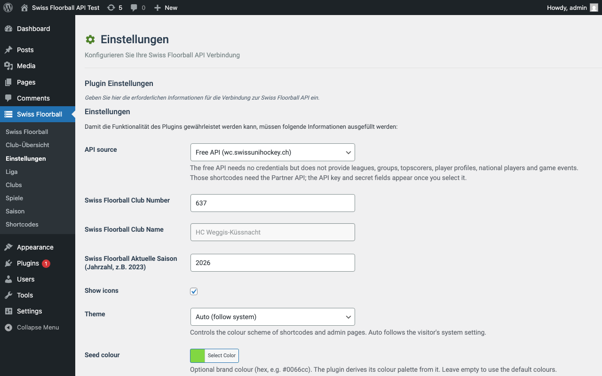
*Configure your Club ID and Season in the settings. Choose the Partner API as API source to show the key and secret fields:*

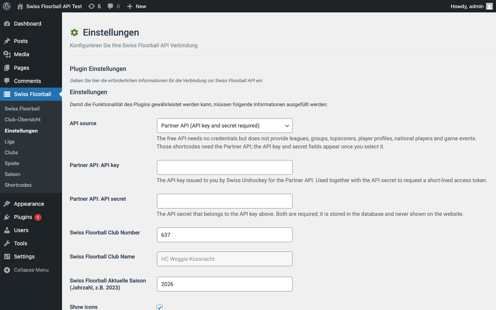

### API sources

The free API is a read-only whitelist. Shortcodes that need an endpoint it does not offer show a notice that points to the settings.

| Data | Free | Partner |
|------|:----:|:-------:|
| Games, rankings, teams, clubs, seasons, cups, game details | ✅ | ✅ |
| Leagues and groups (ID finder) | ❌ | ✅ |
| Topscorers, player profiles, national players, game events | ❌ | ✅ |
| Calendars / ICS links (generated by the plugin from the games) | ✅ | ✅ |

### Settings

| Setting | Description |
|---------|-------------|
| API source | Where the data comes from (`swissfloorball_api_source`). **Free API** (default, `wc.swissunihockey.ch`) or **Partner API** (`office.swissunihockey.ch`, needs credentials). See the table below for what each source provides. |
| Partner API key / secret | Credentials for the Partner API (`swissfloorball_api_key`, `swissfloorball_api_secret`). Only used when the source is *Partner API*; the plugin exchanges them for a short-lived auth token. |
| Swiss Floorball Club Number | Your club's ID (`swissfloorball_club_number`), used by the club shortcodes. |
| Swiss Floorball Club Name | Filled in automatically from the API when you save a new Club ID (`swissfloorball_club_name`). |
| Swiss Floorball Aktuelle Saison | Season as a year, e.g. `2025` (`swissfloorball_actual_season`). Used when a shortcode has no `season` attribute. |
| Show icons | Show or hide all icons in the admin and in the shortcodes (on by default). |
| Theme | Controls whether the plugin uses light, dark, or auto (follows system preference) colors (`swissfloorball_theme`). Option values are `auto` (default), `light`, or `dark`. |
| Seed colour | Optional brand colour as hex, e.g. `#0066cc` (`swissfloorball_seed_color`). Primary and secondary colours are derived from it for light and dark mode with AA text contrast. Leave empty for the default colours. |
| Table style | `flat` (default: no border or shadow, thin row dividers, accent line under the header) or `classic` (the previous boxed look) (`swissfloorball_table_style`). |
| Table colours | Optional hex colours picked with the WordPress colour picker: accent (header line), header text, row divider and row highlight (`swissfloorball_table_{accent,header,divider,highlight}_color`). Accent and header text are adjusted to keep AA contrast in light and dark mode. Empty uses the defaults derived from the seed colour. |
| Striped table rows | Subtle zebra striping for table rows (`swissfloorball_table_striped`, off by default). |
| API request timeout (seconds) | Seconds to wait for the API, 1-30 (default 3). |

The admin interface is currently in German. Under **Cache Verwaltung** the button **Cache leeren** removes all cached API responses. Changing the Club Number clears the cache automatically.

## 📝 Shortcodes

Use these shortcodes in any Page or Post to display data. Attributes that are left out fall back to the values from the settings page where applicable.

### Club & Team Data

| Shortcode | Description | Attributes |
|-----------|-------------|------------|
| `[swfl-club-teams]` | List all teams in your club. | None |
| `[swfl-club-games]` | Club games, shown week by week with previous/next week buttons. | `season` |
| `[swfl-team-games]` | Games of one team, paged around the next game. | `team_id`, `season`, `page_size` (default 4) |
| `[swfl-club-team-games]` | All teams of a club with a team selector and their games. | `season`, `page_size` (default 4) |
| `[swfl-teams]` | List teams. | None |
| `[swfl-clubs]` | List all clubs. | None |
| `[swfl-calendars]` | Show upcoming games + ICS link. | `team_id`, `club_id`, `season`, `league`, `game_class`, `group` |

**Example:**

```
[swfl-calendars team_id="427892"]
[swfl-club-team-games season="2025" page_size="6"]
```

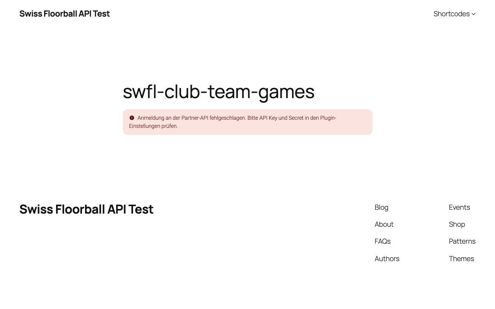

The games, ranking and Mobiliar topscorer shortcodes mirror the official [Swiss Unihockey web components](https://github.com/swissunihockey/swissunihockey-webcomponents) (`uniho-*`). Attribute names with hyphens (`game-class`, `club-id`, `page-size`) work as well as the underscore forms. Week and page navigation need JavaScript; without it the initial view is still shown.

### League & Rankings

| Shortcode | Description | Attributes |
|-----------|-------------|------------|
| `[swfl-league-games]` | Games of a league and group, navigable round by round; playoff series are grouped. | `game_class`, `league`, `season`, `group` |
| `[swfl-rankings]` | Show the ranking table. | `season`, `league`, `game_class`, `group` (name, e.g. `Gruppe 1`) |
| `[swfl-mobiliar-topscorer]` | The Mobiliar topscorers as cards: of the whole league, or of one club when `club_id` is set. | `club_id`, `season` |
| `[swfl-topscorers]` | Show the topscorer list. | `season`, `league`, `game_class`, `group` |
| `[swfl-groups]` | List available groups. | `season`, `league`, `game_class` |
| `[swfl-cups]` | List available cups. | None |

**Example:**

```
[swfl-rankings season="2025" league="3" game_class="21" group="Gruppe 1"]
```

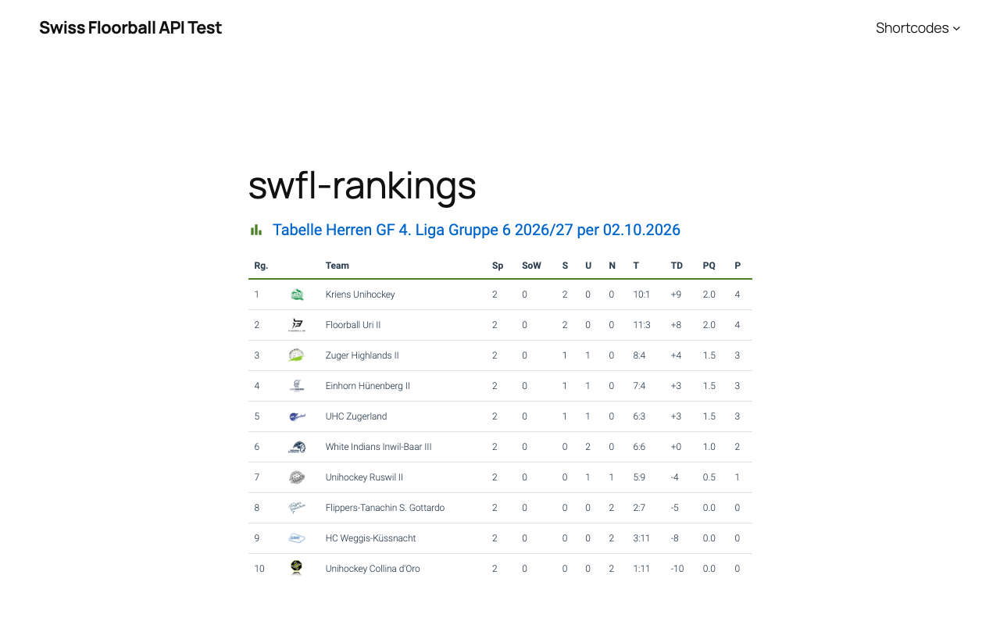

### Players & Games

| Shortcode | Description | Attributes |
|-----------|-------------|------------|
| `[swfl-player]` | Show player profile. | `player_id` |
| `[swfl-game-events]` | Show events (goals, penalties) of a game. | `game_id` |
| `[swfl-national-players]` | List national team players. | None |

## 🎨 Customization

The plugin uses standard CSS classes prefixed with `.sfa-`, scoped to `.swiss-floorball-plugin`. You can override them in your theme's `style.css` or the Customizer to match your site's branding.

## 🖼 Icons

The plugin ships inline SVG icons from [Material Symbols](https://github.com/google/material-design-icons) (Outlined, filled, Apache License 2.0, see `THIRD-PARTY.md`). No fonts or external requests are used.

* **Setting:** Show or hide all icons under **Settings > Swiss Floorball API > Show icons** (option `swissfloorball_show_icons`, on by default).
* **Styling:** Use the CSS variables `--swfl-icon-size` and `--swfl-icon-color` on `.swiss-floorball-plugin`.
* **Filter:** `swfl_icon_svg` lets you replace an icon. The result is sanitized with `wp_kses()` (only `svg`, `path` and `span` with a fixed set of attributes are kept).

```php
add_filter( 'swfl_icon_svg', function ( $svg, $name, $args ) {
	if ( 'refresh' === $name ) {
		return '<svg viewBox="0 0 24 24" width="1em" height="1em" fill="currentColor" aria-hidden="true"><path d="M12 4V1L8 5l4 4V6a6 6 0 1 1-6 6H4a8 8 0 1 0 8-8z"/></svg>';
	}
	return $svg;
}, 10, 3 );
```

## 🧩 Developer Hooks

| Hook | Type | Description |
|------|------|-------------|
| `swfl_icon_svg` | Filter | Replace the SVG markup of an icon. |
| `swfl_request_timeout` | Filter | Override the API request timeout (seconds). Takes precedence over the setting. |

## ❓ FAQ

**Q: Where do I find the IDs?**  
A: You can find Team, Club, and League IDs in the URL on the [Swiss Floorball website](https://www.swissunihockey.ch) or by using the plugin backend to explore and copy the IDs.

**Q: Why does my data not update right away?**  
A: API responses are cached for one hour. Use the **Cache leeren** button on the settings page to refresh immediately.

**Q: Is this plugin free?**  
A: Yep! It's open-source and completely free to use.

**Q: Is this an official Swiss Floorball plugin?**  
A: Nope. This plugin isn't official and has no connection to Swiss Floorball.

**Q: Can I use this plugin for commercial purposes?**  
A: Yes. As GPLv2-or-later licensed software, it can be used on any site, including commercial ones. It was built for Swiss Floorball clubs and teams to show their data on their websites, but nothing stops other use.

**Q: Any further questions?**  
A: Just drop me a message on [GitHub](https://github.com/flawas), [LinkedIn](https://www.linkedin.com/in/flawas/), or via my [homepage](https://flaviowaser.ch/contact/).

## 🔗 External Services

This plugin connects to the **Swiss Unihockey API**: by default the free `wc.swissunihockey.ch`, optionally the Partner API on `office.swissunihockey.ch`, depending on the *API source* setting.
It is used to retrieve floorball data such as club games, team rosters, league rankings, player statistics, and calendar feeds.

**What data is sent and when:**
- Your configured Club ID and Season are sent to the API every time a shortcode is rendered or an admin page is loaded.
- No personal data of website visitors is transmitted. All requests are read-only.

**Service provider:** Swiss Unihockey (Floorball Schweiz)  
[Terms of Service](https://www.swissunihockey.ch/index.php?cID=1186) | [Privacy Policy](https://swissunihockey.tlex.ch/app/de/texts_of_law/2-7)

## 📸 Screenshots

1. **Dashboard**: Club, season and API source at a glance, with navigation tiles.
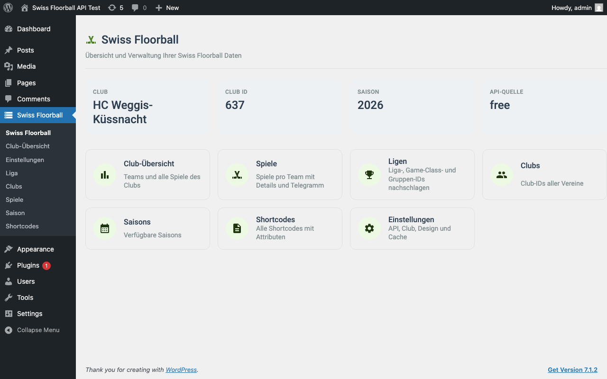
2. **Settings**: API source (free or Partner API), club, season, theme and table style.

3. **Club overview**: Teams and games of your club.
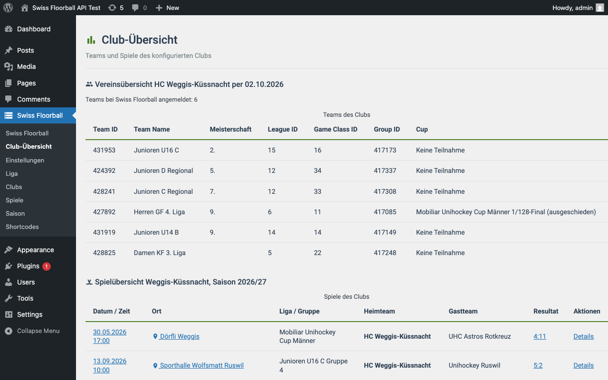
4. **Club games**: Games week by week with previous/next buttons (`[swfl-club-games]`).
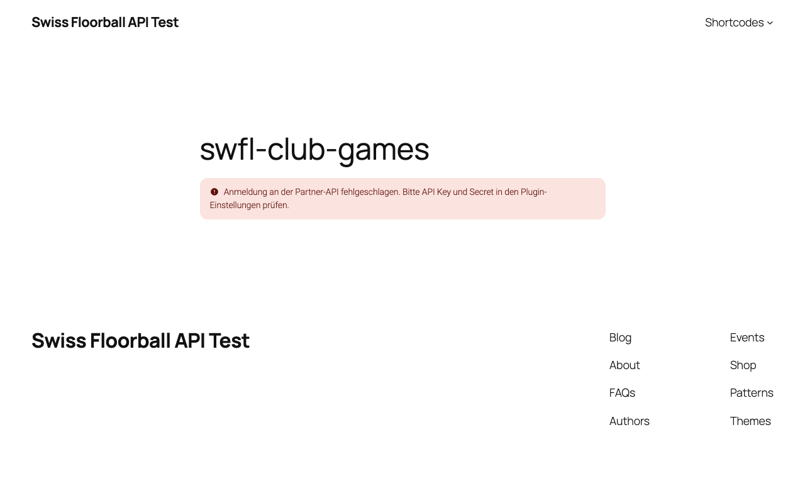
5. **Rankings**: League table of a group (`[swfl-rankings]`).

6. **League games**: Games of a league and group, round by round (`[swfl-league-games]`).
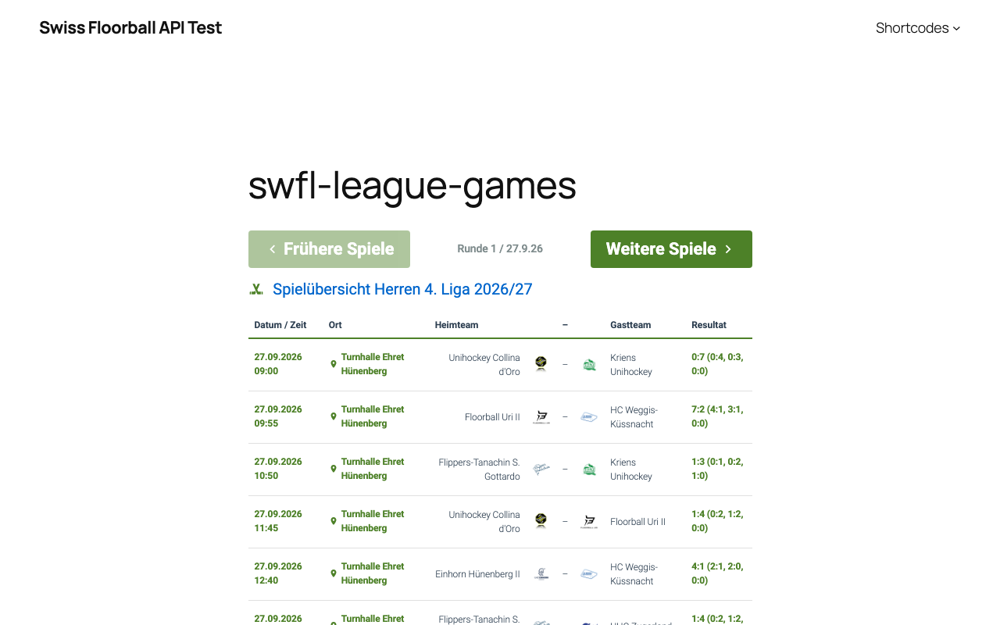
7. **Mobiliar topscorers**: Cards for the league or one club (`[swfl-mobiliar-topscorer]`).
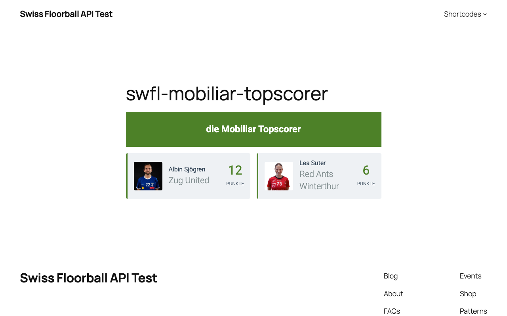
8. **Calendar**: Upcoming games with an iCalendar subscription link (`[swfl-calendars]`).
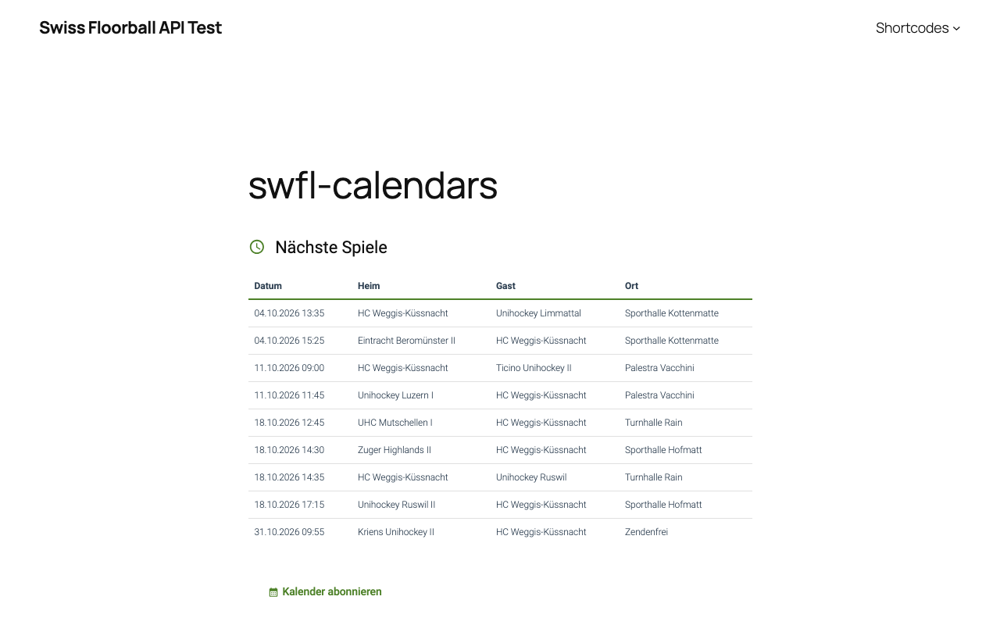
9. **Mobile**: The widgets follow the width of their container, without horizontal scrolling.
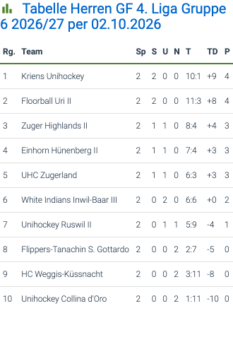

## ⬆️ Upgrading to 2.0.0

Version 2.0.0 contains breaking changes (API source, calendar feed, shortcode attributes, markup). Read the [upgrade guide](docs/migration.md) before updating. In short:

1. Leagues, groups, topscorers, player profiles, national players and game events need the **Partner API** (API key and secret from Swiss Unihockey). Select it under *API source*; the key and secret fields appear only then.
2. Use group names (`Gruppe 1`) in `[swfl-rankings]` and `[swfl-topscorers]`.
3. Subscribe to calendars again (new URL `/wp-json/swfl/v1/calendar`).
4. Check custom CSS, or set *Table style* to `classic`.

## 📜 Changelog
### 2.0.0 (2026-10-02)
* **Breaking:** API source switch. `api-v2.swissunihockey.ch` is no longer used; the default is the free API (`wc.swissunihockey.ch`), optionally the Partner API (`office.swissunihockey.ch`, API key + secret). Leagues, groups, topscorers, player profiles, national players and game events need the Partner API. See [docs/migration.md](docs/migration.md)
* **Breaking:** Calendar subscriptions: the old calendar export is gone. The plugin serves its own iCalendar feed at `/wp-json/swfl/v1/calendar`; previously subscribed URLs must be subscribed again
* **Breaking:** `[swfl-rankings]` and `[swfl-topscorers]` take the group name (`Gruppe 1`) instead of a group ID; `[swfl-club-games]` and `[swfl-team-games]` now page by week / around the next game and need JavaScript and the public REST routes `swfl/v1/*` for navigation
* **Breaking:** New table markup and styling (flat style, `.sfa-table-wrap`, `--sfa-sys-*` tokens). Custom CSS targeting the old markup needs a check; set *Table style* to `classic` for the previous look
* Change: Major release. The default API source is now the free Swiss Unihockey API, shortcodes follow the official web components, and the frontend and admin were redesigned (see below). Review the *Remove* entry before updating if you used the former API source
* Change: Settings page: the Partner API key and secret fields have clear labels and descriptions and are only shown while *Partner API* is selected as API source. All settings inputs and dropdowns share one compact size
* Fix: The admin script is versioned by its modification time, so browsers no longer serve a stale cached copy after an update
* Change: `[swfl-mobiliar-topscorer]` no longer defaults to the configured club. Without `club_id` it shows the Mobiliar topscorers of the whole league; with `club_id` it filters to that club
* Change: Responsive widgets without a horizontal scrollbar. Layout now follows the width of the widget (container queries) instead of the screen width, because theme content columns are often much narrower than the viewport: compact cells and wrapping text first, then minor columns (ranking details, league column, venue, logos) are hidden on narrow widths; the paging buttons wrap below the label; the dark wrapper uses less padding on phones. The calendar table headers now read Heim/Gast (they showed Goal/Resultat)
* New: Frontend icons (controlled by the *Show icons* setting): section titles, previous/next buttons, calendar title and subscribe link, error notices, and a map link with a pin icon on venue cells (OpenStreetMap, from the venue coordinates of the API)
* Remove: The previous API (`api-v2.swissunihockey.ch`) is no longer an API source. Installations that had it selected fall back to the free API; leagues, groups, topscorers, player profiles, national players and game events are then only available through the Partner API. Calendar subscriptions no longer use the old calendar export: the plugin now serves its own iCalendar feed at `/wp-json/swfl/v1/calendar` (`team_id`, `club_id` or `league` + `game_class` + `group`, optional `season`), built from the games of the free API
* Change: New admin dashboard with stat tiles (club, club ID, season, API source) and navigation tiles. The club overview (teams) and the club games list moved from the dashboard to a separate submenu page "Club-Übersicht" (Issue #94)
* Change: Admin pages without big boxes: the gradient header became a slim top app bar, cards, table containers and form sections sit flat on the page (no border, shadow or hover lift), quick-access links are compact tonal buttons and the settings overview is a divided key/value list (Issue #94)
* Change: All tables share the look of the games widgets (`swfl-club-team-games`, `swfl-league-games`): section title, scrollable `.sfa-table-wrap`, right-aligned numbers, highlighted rows and bold links. The admin game lists (Spiele, dashboard) now render with the same code and markup as the shortcodes plus a Details link, and the admin tables follow the flat style and the table colour settings (Issue #94)
* New: Flat table style (new default) with backend settings for table style (`flat`/`classic`), accent, header text, divider and highlight colours (colour picker, AA contrast guaranteed) and optional striped rows. The wrapper gets `sfa-table--flat|classic` (and `sfa-table--striped`); choose `classic` to keep the previous boxed look (Issue #94)
* New: Shortcodes modelled on the official Swiss Unihockey web components: `swfl-league-games`, `swfl-club-team-games` and `swfl-mobiliar-topscorer`. `swfl-club-games` now shows games week by week, `swfl-team-games` pages around the next game (`page_size`, `season`) and `swfl-rankings` takes the group name (e.g. `Gruppe 1`). Navigation uses a small script and the REST routes `swfl/v1/team-games` and `swfl/v1/league-games`
* New: API source setting. The plugin now uses the free Swiss Unihockey API (`wc.swissunihockey.ch`) by default and can be switched to the Partner API (api key + secret, auth token). Endpoints the free API does not offer (leagues, groups, topscorers, players, national players, game events) show a clear notice instead of a generic error
* New: Optional Seed colour setting (hex). Derives the primary/secondary `--sfa-sys-color-*` tokens, including `on-*` colours with AA contrast, for light, dark and auto mode on the frontend and in the admin. Empty keeps the default look; a set value overrides `--sfa-primary` / `--sfa-secondary` theme overrides
* New: Theme setting (Auto / Light / Dark, default Auto) under Settings. Dark colours are `--sfa-sys-*` tokens scoped to the plugin containers (`data-sfa-theme` on `.swiss-floorball-plugin` and `.sfa-admin-wrap`); Auto follows `prefers-color-scheme`. The old hard-coded dark block was replaced by these tokens
* Fix: Plugin Check readme issues: "Tested up to" raised to 7.1 and short description shortened to 150 characters or less
* Fix: Resolve phpcs findings in admin and display classes: add translator comments, escape wp_die, use wp_safe_redirect, annotate DB queries (Issue #75)
* New: Admin dashboard restyled in Material 3 (header, tonal navigation buttons, outlined form fields, filled/outlined buttons, cards and tables) using the `--sfa-sys-*` tokens; 48 px touch targets and visible keyboard focus. Markup, shortcodes and options are unchanged
* Change: Frontend tables and cards in Material 3 look using only `--sfa-sys-*` tokens: surface-container tables with dividers, hover/focus state layer, sticky header, `.sfa-card` variants (`--elevated`, `--filled`, `--outlined`), 48 px touch targets and reduced-motion support. On narrow screens tables now scroll horizontally instead of switching to a card layout
* New: Visually hidden `<caption>` and `scope` attributes on all plugin tables for accessibility
* Change: Frontend buttons (`.button`, `.btn`), calendar subscribe link, info boxes and empty states restyled with the `--sfa-sys-*` tokens (state layers, focus ring, 48px touch targets, motion tokens). Themes that style `.button` inside the plugin will see the new look
* Change: Failed API requests render a `.sfa-info-box--danger` banner with `role="alert"` instead of a bare paragraph; the calendar link gets `rel="noopener noreferrer"`; `.sfa-empty-state*` now styled (legacy `.empty-state*` kept)
* New: Design-token layer (`--sfa-sys-*` colors, typography, shape, elevation 0-5) for the frontend and admin styles, scoped to `.swiss-floorball-plugin` / `.sfa-admin-wrap`. Existing `--sfa-*` variables, Roboto and dark mode are unchanged; no visual change
* Fix: Add explicit request timeout (5 seconds, minimum 1 second) to API client calls, filterable via `swfl_request_timeout` hook
* Fix: Add `apply_filters()` stub to verify_api.php for test compatibility
* New: Icon infrastructure. `Swiss_Floorball_Api_Icons::get()` accepts an argument array (`class`, `label`) and loads Material Symbols SVGs from `public/icons/` (`calendar_month`, `location_on`, `error`, `info`, `refresh`)
* New: Setting `swissfloorball_show_icons` and filter `swfl_icon_svg`
* Removed: Unused `render_sessions()` stub that issued a discarded API request
* New: Setting `swissfloorball_request_timeout` (API request timeout, 1-30 seconds) on the settings page; it provides the default of the `swfl_request_timeout` filter, which still overrides it
* Security: Replace cache-cleared notice GET parameters with transient-based notification
* Change: Default API request timeout lowered from 5 to 3 seconds
* Fix: Render player details via shortcode `[swfl-player]` without dumping raw API response — now displays structured data as a table with all values escaped (PR #61)
* Fix: Escape LIKE patterns in transient cleanup queries to prevent wildcard interpretation
* Fix: Admin class methods to snake_case; prefix template variables with `swfl_`; apply Yoda conditions (PR #50, WPCS step 4/5)
* Fix: End inline comments with full stops (WPCS 3c2)
* Fix: Rename global functions to snake_case (WPCS)

### 1.0.5 (2026-08-09)

* Fix: Remove FAQ answer restricting the plugin to "personal and non-commercial use" — this contradicted the GPLv2-or-later license, which grants unrestricted use including commercial. Not allowed under WordPress.org plugin guidelines.
* Fix: Add `Requires PHP` and `License URI` fields to the readme header
* Fix: Correct Text Domain (header + all translation strings) from `floorball-api-for-swiss-unihockey` to `swiss-floorball-api` to match the assigned WordPress.org slug
* Fix: Rename `languages/floorball-api-for-swiss-unihockey.pot` to `languages/swiss-floorball-api.pot` to match the text domain
* Fix: Update "Tested up to" to WordPress 7.0
* Fix: Exclude `graphify-out/`, `.vscode`, `.claude`, and `.DS_Store` from the release ZIP and SVN deploy via `.distignore` — these dev-tool artifacts (including files with `&`/`()` in their names) were failing the automated plugin scan
* Fix: Update release workflow `SLUG` and build/zip folder names from `floorball-api-for-swiss-unihockey` to `swiss-floorball-api`
* Fix: Correct `.gitignore` readme.txt casing for case-sensitive CI filesystems

### 1.0.4 (2026-05-04)

* Security: Add nonce and permission checks for all admin `$_GET`/`$_POST` actions
* Security: Sanitize nonce with `wp_unslash()` + `sanitize_text_field()` before `wp_verify_nonce()`
* Security: Escape all dynamic HTML attributes with `esc_attr()` in settings field renderer
* Fix: Add `ABSPATH` guard to main plugin file and admin matches partial
* Fix: Rename plugin slug to `floorball-api-for-swiss-unihockey` for WordPress.org listing
* Fix: Rename all shortcodes from `suh-*` to `swfl-*` to meet 4-character prefix requirement
* Fix: Prefix settings group and section IDs with `sfa_` to avoid naming collisions
* Fix: Remove `load_plugin_textdomain()` call — not needed since WordPress 4.6
* Fix: Update "Tested up to" to WordPress 6.9
* Fix: Remove angle brackets from Donate link URL
* Fix: Exclude `.distignore` and `README.md` from release ZIP
* Improvement: Document external service (Swiss Unihockey API) with Terms of Service and Privacy Policy links

### 1.0.3 (2026-05-03)

* Security: Use `$wpdb->prepare()` for all database queries to prevent SQL injection
* Security: Sanitize all shortcode attributes with `absint()` before passing to API
* Security: Escape all `admin_url()` outputs with `esc_url()`
* Fix: Scoped all CSS to plugin containers to prevent styling conflicts with other theme elements (buttons, notices, etc.)
* Fix: Dark mode CSS variables scoped to `.swiss-floorball-plugin` / `.sfa-admin-wrap` instead of `:root`
* Fix: `prefers-reduced-motion` rule scoped to plugin elements only
* Fix: `scroll-behavior: smooth` scoped to plugin container instead of `html`
* Fix: Admin `.button-primary` styles scoped to `.sfa-admin-wrap` to avoid overriding WordPress core buttons
* Performance: CSS and JS only enqueued on pages/posts that contain a plugin shortcode (frontend) or on plugin admin pages (backend)
* Improvement: Replaced all inline styles in templates with reusable CSS classes
* Improvement: Added `aria-label` to admin search input for accessibility
* Improvement: Removed `console.log` statements from admin JavaScript
* Improvement: Use `const`/`let` and `.includes()` in admin JavaScript
* Improvement: Use `require_once` instead of `require` for the main plugin class
* Fix: Version constant `SWISS_FLOORBALL_API_VERSION` now matches plugin header version
* Improvement: Calendar link now has correct desktop styles (was previously only styled on mobile)
* Improvement: Replaced remaining inline styles in admin partials (matches, settings, shortcodes) with CSS classes
* Improvement: Replaced hardcoded colors in admin CSS with CSS variables
* Improvement: Escaped remaining `admin_url()` outputs in shortcodes partial

### 1.0.2 (2026-01-02)

* Fix: Mobile table background color
* Fix: Mobile table text alignment

### 1.0.1 (2025-11-30)

* Feature: Implement detailed matches display in admin
* Feature: Scope public CSS
* Fix: Add release workflow documentation
* Fix: Consistent language and naming in code

### 1.0.0 (2025-11-29)

* Initial release

---

*Developed by [Flavio Waser](https://flaviowaser.ch)*
