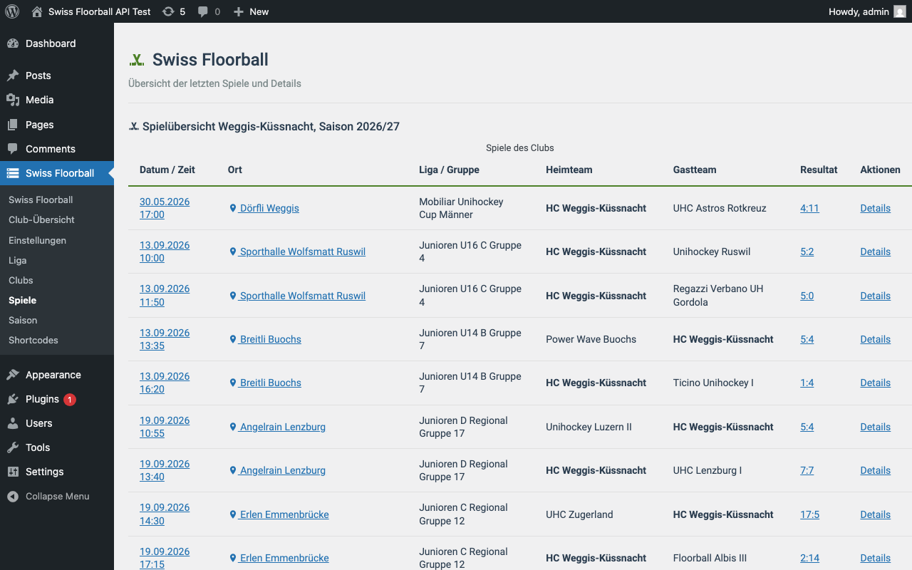
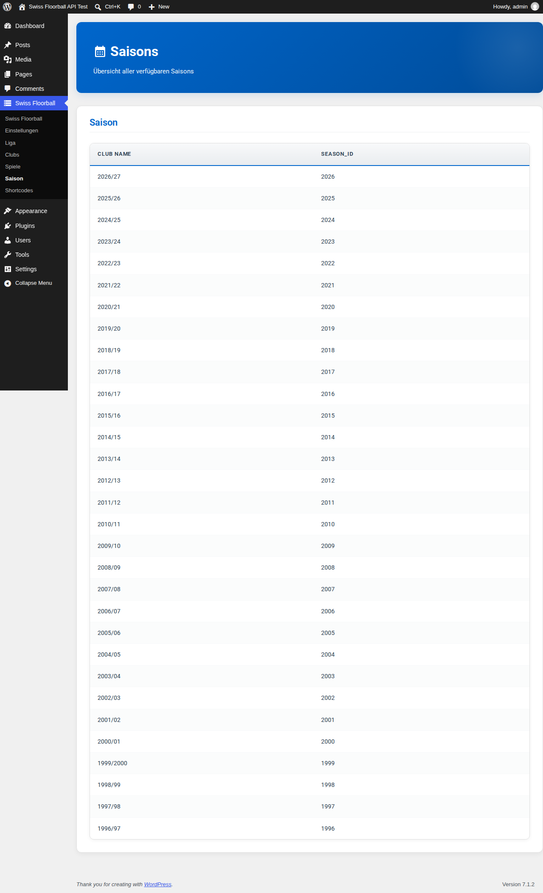

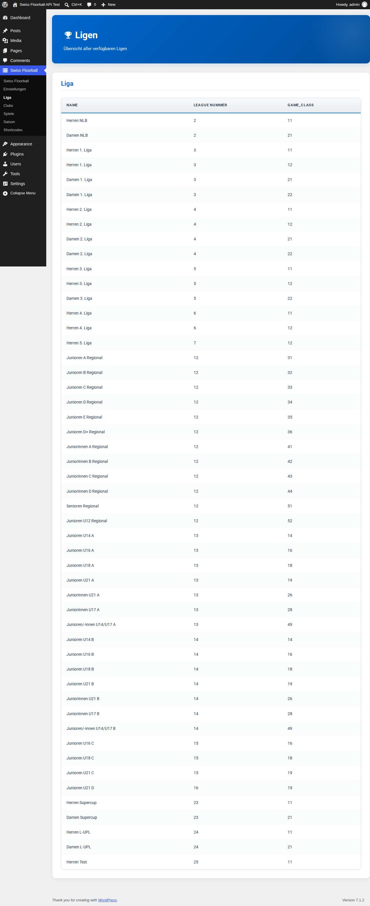
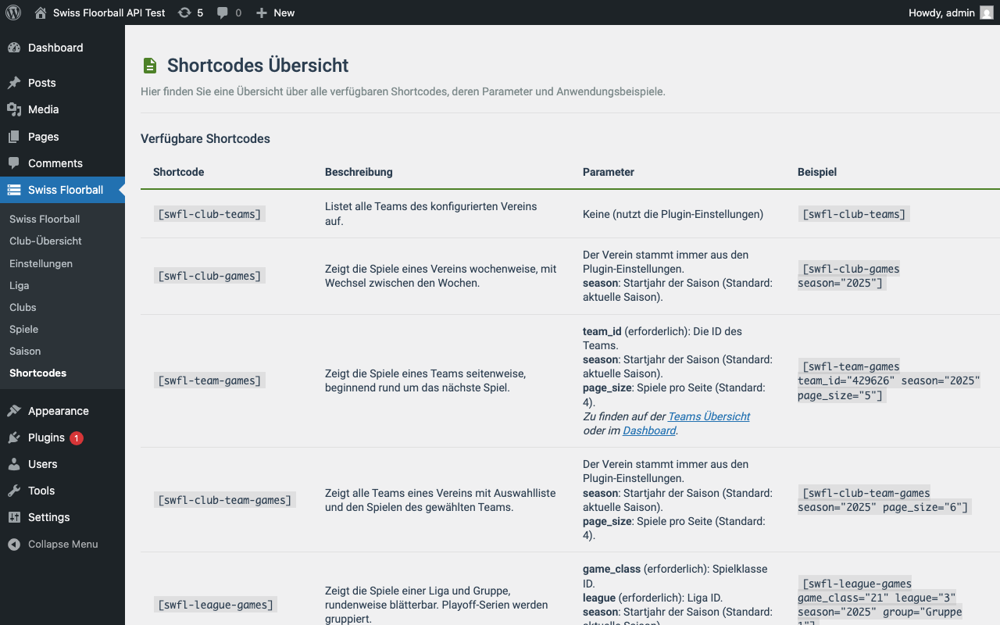

# Administration

Das Menü «Swiss Floorball» (Capability `manage_options`, Menüposition 26) wird in `admin/class-swfl-admin.php` (`addPluginAdminMenu()`) angelegt.

## Einstellungen

Untermenü «Einstellungen» (Gruppe `swfl_general_settings`). Gespeichert als WordPress-Optionen:

| Option | Bedeutung | Bereinigung |
|---|---|---|
| `swfl_club_number` | Club-Nummer (ID) | `absint`; bei Änderung wird der API-Cache geleert und der Club-Name automatisch geholt |
| `swfl_club_name` | Club-Name, nur Anzeige (wird automatisch gesetzt) | – |
| `swfl_actual_season` | Aktuelle Saison als Jahreszahl, z. B. `2025` | `absint` |
| `swfl_show_icons` | Icons anzeigen (Standard `1`) | `'1'` oder `'0'` |
| `swfl_request_timeout` | API-Timeout in Sekunden (1–30, Standard `3`) | `absint`, begrenzt auf 1–30; 0/ungültig → `3` |
| `swfl_api_source` | API-Quelle: `free` (Standard) oder `partner` | nur diese zwei Werte, sonst `free`; leert das Auth-Token |
| `swfl_api_key` | Partner-API: API-Key | `sanitize_text_field`; leert das Auth-Token |
| `swfl_api_secret` | Partner-API: API-Secret (Passwortfeld) | nur Steuerzeichen und umgebende Leerzeichen entfernt (`sanitize_text_field` würde gültige Zeichen verändern); leert das Auth-Token |
| `swfl_theme` | `auto` (Standard), `light`, `dark` | Whitelist |
| `swfl_seed_color` | Markenfarbe (Hex), leer = Standardfarben | Hex-Prüfung |
| `swfl_table_style` | `flat` (Standard) oder `classic` | Whitelist |
| `swfl_table_striped` | Zebra-Streifen (Standard aus) | `'1'` oder `'0'` |
| `swfl_table_{accent,header,divider,highlight}_color` | Tabellenfarben (Farbwähler) | Hex-Prüfung |

### API-Quelle und Partner-Zugangsdaten

Die Felder «Partner API: API key» und «Partner API: API secret» sind nur sichtbar, solange «API source» auf **Partner API** steht (JavaScript, `admin/js/…-admin.js`). Beide Felder sind Pflicht und werden zusammen verwendet: Das Plugin tauscht sie gegen ein kurzlebiges Auth-Token. Bei der **Free API** werden sie nicht verwendet und bleiben beim Speichern erhalten. Welche Funktionen nur mit der Partner-API laufen, steht in [Umstieg auf 2.0.0](migration.md#1-wechsel-der-api-quelle).

### Cache leeren

Auf der Einstellungsseite löst ein Formular `admin_post_swfl_clear_cache` aus (Nonce `swfl_clear_cache_action`, Capability `manage_options`). Es löscht alle Transients `swfl_*` und leitet mit Hinweis zurück.

## Helper-Seiten

| Seite | Zweck |
|---|---|
| Dashboard | Kennzahlen (Club, Club-ID, Saison, API-Quelle) und Kachelnavigation |
| Club-Übersicht | Teams des Clubs und Clubspiele |
| Liga | Ligen (`leagues`) mit IDs für `league` und `game_class` (nur Partner-API) |
| Clubs | Clubs (`clubs`) mit Club-IDs |
| Spiele | Spiele des Clubs; Klick auf ein Spiel zeigt Details und Ereignisse (`match_id`) und liefert die Spiel-ID |
| Saison | Saisons (`seasons`) für `season` |
| Shortcodes | Übersicht der Shortcodes |

Beispiele der Helper-Seiten:

Die Seiten nutzen dieselben `SWFL_Display::render_*`-Methoden wie die Shortcodes (siehe [Architektur](architecture.md)).

## IDs finden

- **Club-ID:** Seite «Clubs».
- **Saison:** Seite «Saison» (Jahreszahl).
- **Liga / Spielklasse (`league`, `game_class`):** Seite «Liga».
- **Gruppe:** Shortcode [`swfl-groups`](shortcodes.md#swfl-groups) mit Liga und Spielklasse (nur Partner-API). Für `swfl-rankings` und `swfl-league-games` den Gruppennamen verwenden, z. B. `Gruppe 1`.
- **Team-ID:** Shortcode `swfl-club-teams` bzw. Seite «Clubs».
- **Spiel-ID:** Seite «Spiele».

Weiter: [Fehlerbehebung](troubleshooting.md).
