# Shortcodes

Alle Shortcodes sind in `public/class-floorball-api-for-swiss-unihockey-public.php` registriert (`register_shortcodes()`). Jede Ausgabe steckt in einem `<div class="swiss-floorball-plugin">`. ID-Attribute werden mit `absint()` bereinigt. CSS/JS werden nur auf Seiten geladen, deren Inhalt einen dieser Shortcodes enthält.

Die benötigten IDs findest du in den [Helper-Seiten](admin.md). Änderungen gegenüber 1.x stehen in [Umstieg auf 2.0.0](migration.md#3-geänderte-shortcodes).

Attribute mit Bindestrich (`game-class`, `club-id`, `page-size`) funktionieren wie die Unterstrich-Form. Shortcodes mit Hinweis **Partner-API** zeigen mit der kostenlosen API nur einen Hinweis statt Daten.

| Shortcode | Attribute | Quelle |
|---|---|---|
| `[swfl-club-teams]` | – | beide |
| `[swfl-club-games]` | `season` | beide |
| `[swfl-team-games]` | `team_id`, `season`, `page_size` | beide |
| `[swfl-club-team-games]` | `season`, `page_size` | beide |
| `[swfl-league-games]` | `game_class`, `league`, `season`, `group` | beide |
| `[swfl-mobiliar-topscorer]` | `club_id` (optional), `season` | beide |
| `[swfl-clubs]` | – | beide |
| `[swfl-calendars]` | `team_id`, `club_id`, `season`, `league`, `game_class`, `group` | beide |
| `[swfl-cups]` | – | beide |
| `[swfl-groups]` | `season`, `league`, `game_class` | Partner-API |
| `[swfl-teams]` | – | beide |
| `[swfl-rankings]` | `season`, `league`, `game_class`, `group`, `view` | beide |
| `[swfl-player]` | `player_id` | Partner-API |
| `[swfl-national-players]` | – | Partner-API |
| `[swfl-topscorers]` | `season`, `league`, `game_class`, `group` | Partner-API |
| `[swfl-game-events]` | `game_id` | Partner-API |

Alle Attribute sind Ganzzahlen (ID bzw. Jahreszahl), ausser `group` (Gruppenname, z. B. `Gruppe 1`) und `view`. Der Code erzwingt keine Pflichtattribute: Fehlt ein Wert, wird `0` bzw. leer an die API übergeben und die Ausgabe ist leer oder eine Fehlermeldung. «Pflicht (fachlich)» heisst unten: ohne den Wert ist die Ausgabe nicht sinnvoll.

## `swfl-club-teams`

Teams des Clubs aus den Einstellungen (Club-Nummer), Quelle `clubs/<id>/statistics`. Keine Attribute.

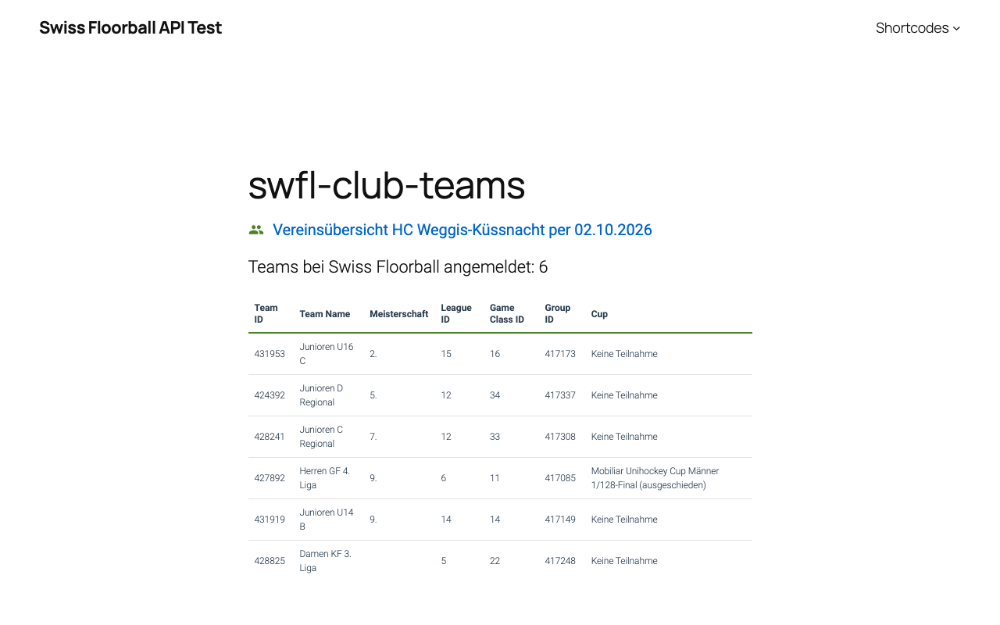

Auf dem Smartphone:

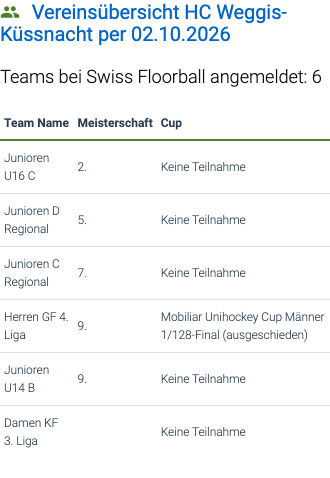

```text
[swfl-club-teams]
```

## `swfl-club-games`

Spiele des Clubs aus den Einstellungen, wochenweise mit Vor-/Zurück-Buttons (braucht JavaScript, ohne bleibt die erste Woche sichtbar).


Auf dem Smartphone:

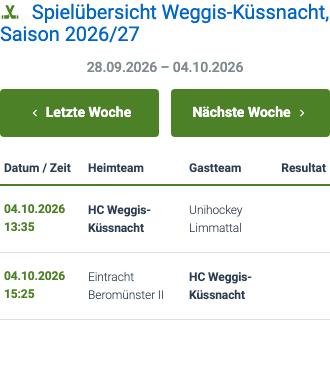

| Attribut | Typ | Default | Pflicht |
|---|---|---|---|
| `season` | int | Option `swissfloorball_actual_season` | nein |

```text
[swfl-club-games]
[swfl-club-games season="2025"]
```

## `swfl-club-team-games`

Alle Teams des Clubs aus den Einstellungen mit Team-Auswahl und den Spielen des gewählten Teams.


Auf dem Smartphone:

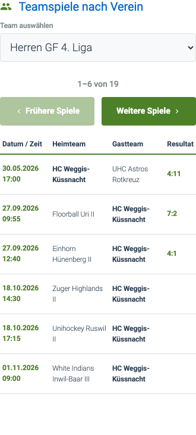

| Attribut | Typ | Default | Pflicht |
|---|---|---|---|
| `season` | int | aktuelle Saison | nein |
| `page_size` | int | `4` | nein |

```text
[swfl-club-team-games season="2025" page_size="6"]
```

## `swfl-league-games`

Spiele einer Liga und Gruppe, runden- bzw. rundenweise navigierbar; Playoff-Serien werden gruppiert.


Auf dem Smartphone:

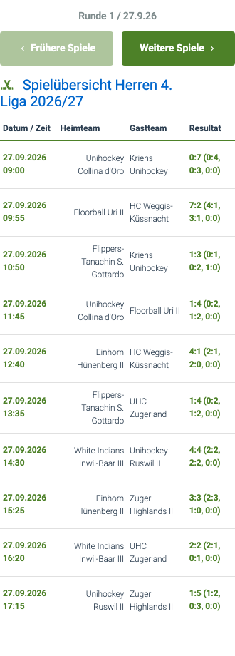

| Attribut | Typ | Default | Pflicht |
|---|---|---|---|
| `game_class` | int | leer | ja (fachlich) |
| `league` | int | leer | ja (fachlich) |
| `season` | int | aktuelle Saison | nein |
| `group` | Text | leer | nein (z. B. `Gruppe 1`) |

```text
[swfl-league-games game_class="11" league="2" group="Gruppe 1"]
```

## `swfl-mobiliar-topscorer`

Die Mobiliar-Topscorer als Karten. **Ohne `club_id` die Topscorer der ganzen Liga**, mit `club_id` nur die eines Clubs (kein Standard-Club mehr).


Auf dem Smartphone:

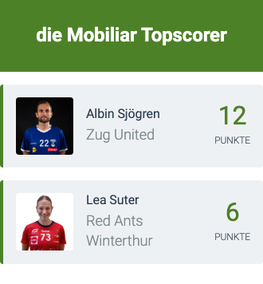

| Attribut | Typ | Default | Pflicht |
|---|---|---|---|
| `club_id` | int | leer (ganze Liga) | nein |
| `season` | int | aktuelle Saison | nein |

```text
[swfl-mobiliar-topscorer]
[swfl-mobiliar-topscorer club_id="463845" season="2025"]
```

## `swfl-team-games`

Spiele eines Teams, seitenweise um das nächste Spiel herum.

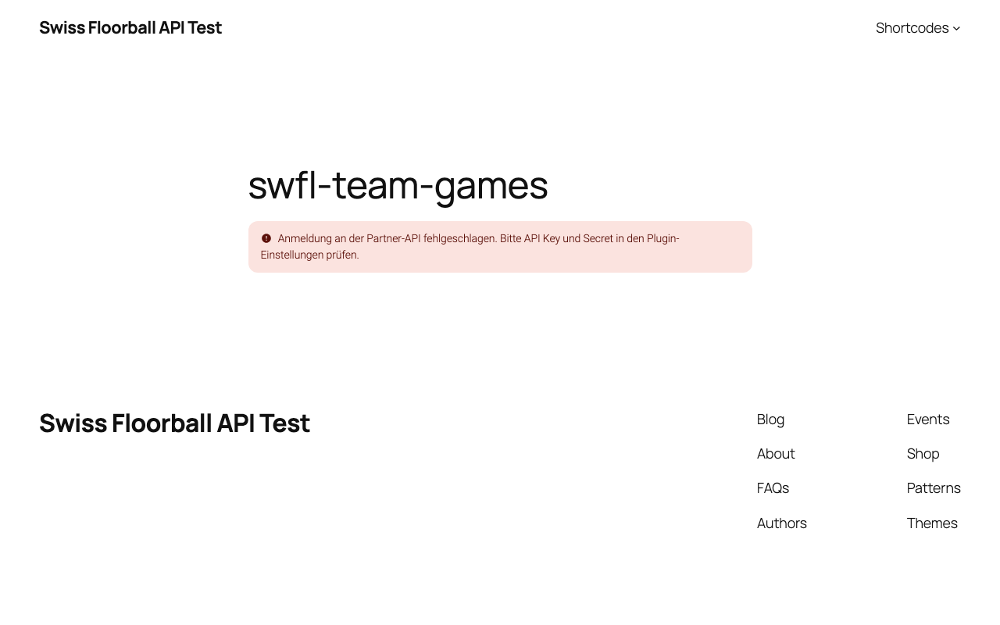

Auf dem Smartphone:

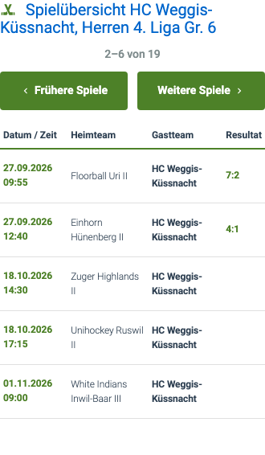

| Attribut | Typ | Default | Pflicht |
|---|---|---|---|
| `team_id` | int | leer | ja (fachlich) |
| `season` | int | aktuelle Saison | nein |
| `page_size` | int | `4` | nein |

```text
[swfl-team-games team_id="429757" page_size="5"]
```

## `swfl-clubs`

Liste aller Clubs (`clubs`). Keine Attribute.

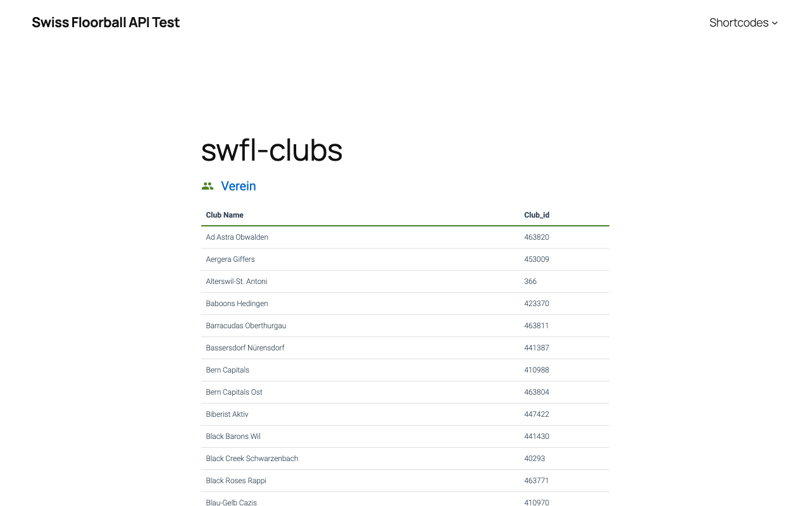

Auf dem Smartphone:



## `swfl-calendars`

Kalender-Link und kommende Spiele. Der Link zeigt auf den eigenen iCalendar-Feed `/wp-json/swfl/v1/calendar` (gebaut aus den Spielen der API, siehe [Architektur](architecture.md#rest-routen)).


Auf dem Smartphone:

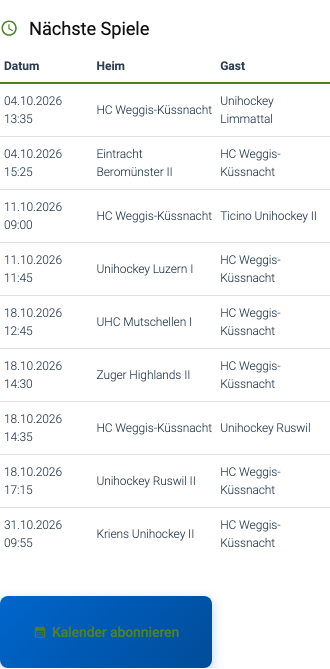

| Attribut | Typ | Default | Pflicht |
|---|---|---|---|
| `team_id` | int | leer | eines von: `team_id`, `club_id` oder alle vier Gruppen-Attribute |
| `club_id` | int | leer | s. o. |
| `season` | int | leer (Fallback: aktuelle Saison) | nur im Gruppen-Modus |
| `league` | int | leer | nur im Gruppen-Modus |
| `game_class` | int | leer | nur im Gruppen-Modus |
| `group` | int | leer | nur im Gruppen-Modus |

Priorität: `team_id`, dann `club_id`, dann Gruppen-Modus (nur wenn `season`, `league`, `game_class` und `group` alle gesetzt sind). Sonst erscheint «Fehlende Parameter für Kalender.».

```text
[swfl-calendars team_id="429757"]
[swfl-calendars club_id="441"]
```

## `swfl-cups`

Liste der Cups (`cups`). Keine Attribute.

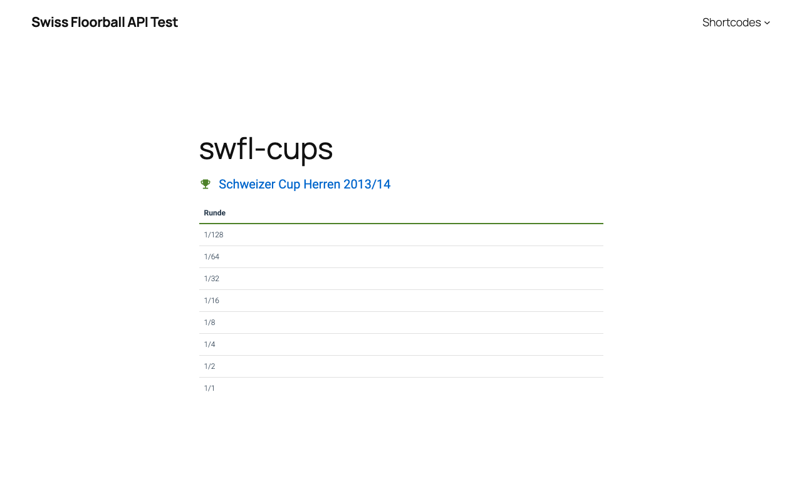

Auf dem Smartphone:

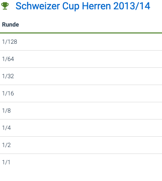

## `swfl-groups`

Gruppen einer Liga/Spielklasse (`groups`, Format `dropdown`). Nur Partner-API.

| Attribut | Typ | Default | Pflicht |
|---|---|---|---|
| `season` | int | Option `swissfloorball_actual_season` | nein |
| `league` | int | leer | ja (fachlich) |
| `game_class` | int | leer | ja (fachlich) |

```text
[swfl-groups league="1" game_class="11"]
```

## `swfl-teams`

Liste aller Teams (`teams`). Keine Attribute.

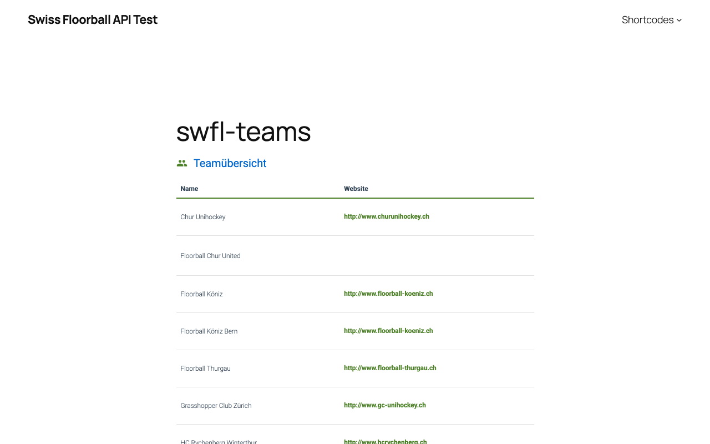

Auf dem Smartphone:

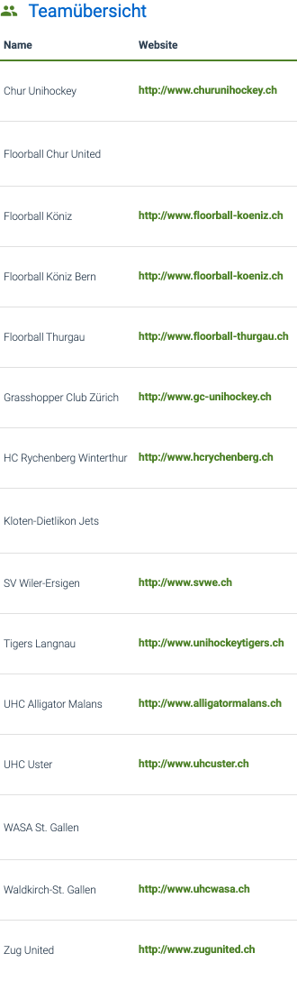

## `swfl-rankings`

Rangliste einer Gruppe (`rankings`).


Auf dem Smartphone passt sich das Layout an die Breite an:


| Attribut | Typ | Default | Pflicht |
|---|---|---|---|
| `season` | int | Option `swissfloorball_actual_season` | nein |
| `league` | int | leer | ja (fachlich) |
| `game_class` | int | leer | ja (fachlich) |
| `group` | Text | leer | ja (fachlich), **Gruppenname** wie `Gruppe 1` (vorher: ID) |
| `view` | Text | `full` | nein |

```text
[swfl-rankings league="1" game_class="11" group="Gruppe 1"]
```

## `swfl-player`

Spielerprofil (`players/<id>`). Nur Partner-API.

| Attribut | Typ | Default | Pflicht |
|---|---|---|---|
| `player_id` | int | leer | ja (fachlich) |

```text
[swfl-player player_id="12345"]
```

## `swfl-national-players`

Liste der Nationalspieler (`national_players`). Keine Attribute. Nur Partner-API.

## `swfl-topscorers`

Topscorer einer Gruppe (`topscorers`). Nur Partner-API.

| Attribut | Typ | Default | Pflicht |
|---|---|---|---|
| `season` | int | Option `swissfloorball_actual_season` | nein |
| `league` | int | leer | ja (fachlich) |
| `game_class` | int | leer | ja (fachlich) |
| `group` | Text | leer | ja (fachlich), Gruppenname wie `Gruppe 1` |

```text
[swfl-topscorers league="1" game_class="11" group="Gruppe 1"]
```

## `swfl-game-events`

Spielereignisse eines Spiels (`game_events/<id>`). Nur Partner-API.

| Attribut | Typ | Default | Pflicht |
|---|---|---|---|
| `game_id` | int | leer | ja (fachlich) |

```text
[swfl-game-events game_id="1234567"]
```

Weiter: [Umstieg auf 2.0.0](migration.md), [Fehlerbehebung](troubleshooting.md), [Architektur](architecture.md).
